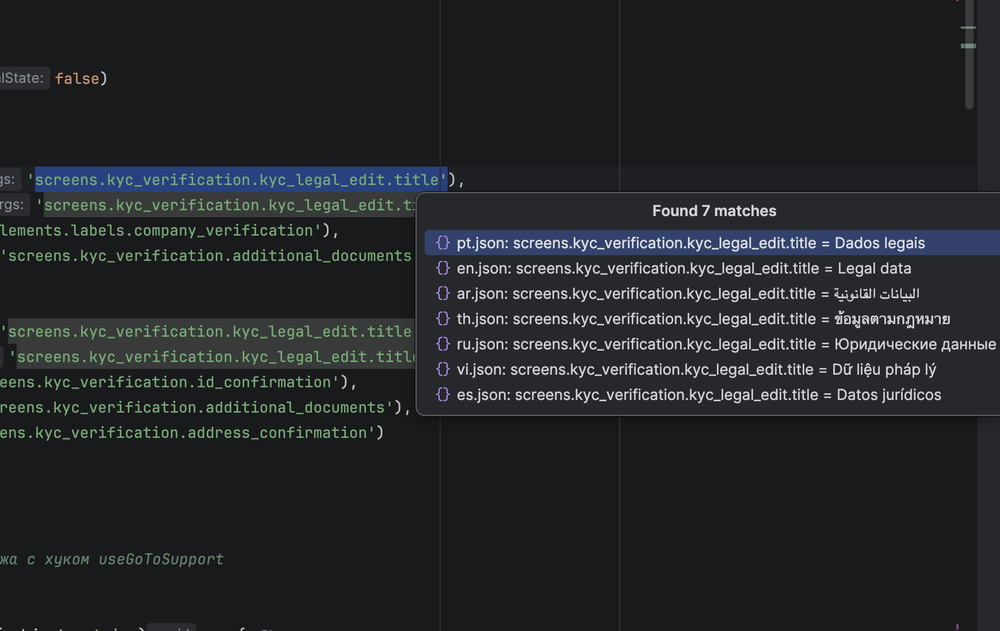
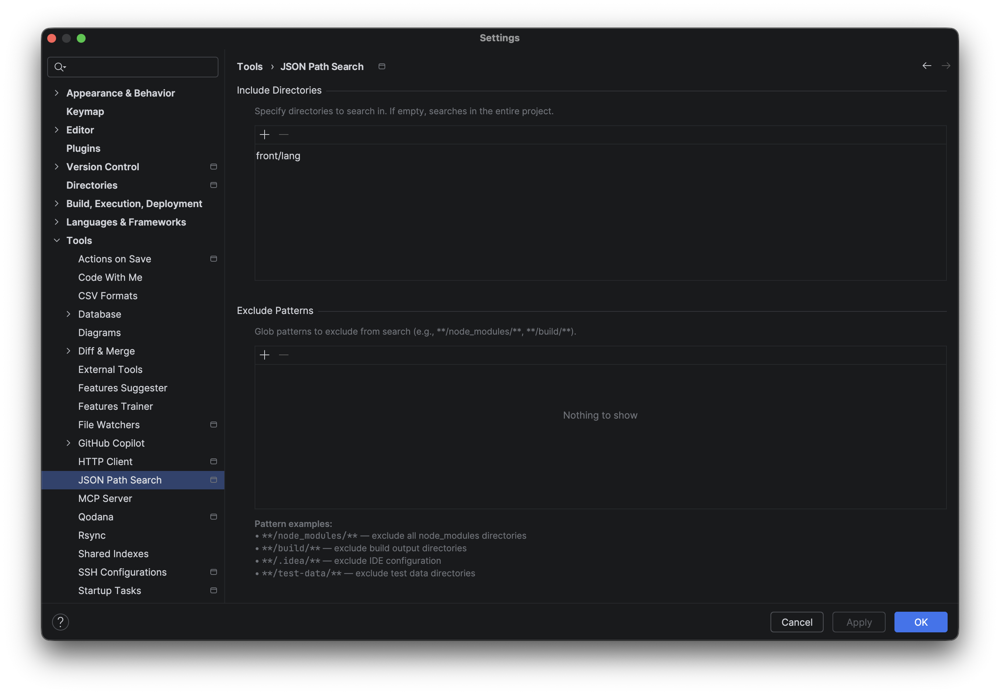

# JSON Path Search

[](LICENSE)

IntelliJ IDEA plugin for searching nested JSON properties by dot-path notation and navigating directly to their locations in project files.

Select a path like `balance.main.title`, hit a shortcut — and instantly jump to the matching property across all your JSON files.

## Features

- **Dot-path search** — find deeply nested JSON properties using familiar dot notation (e.g. `user.profile.name`)
- **Fast navigation** — click on a result to jump straight to the property in the file
- **Background processing** — search runs in a background thread, keeping the UI responsive
- **Configurable scope** — include specific directories or exclude files with glob patterns
- **Array support** — correctly traverses JSON arrays and nested objects
- **Deduplication** — automatically removes duplicate results

## Installation

### From Disk

1. Download the latest release ZIP or [build from source](#building-from-source)
2. Open IntelliJ IDEA → **Settings** → **Plugins**
3. Click ⚙️ → **Install Plugin from Disk...**
4. Select `json-path-search-x.x.x.zip`
5. Restart the IDE

## Usage

1. Select a dot-separated property path in the editor (e.g. `balance.main.title`)
2. Trigger the search:

| Platform       | Shortcut                |
|----------------|-------------------------|
| macOS          | `⌘ + ⇧ + ⌥ + F`        |
| Windows/Linux  | `Ctrl + Alt + Shift + F` |

3. Or right-click → **Search JSON Property Path** in the context menu
4. Click on a result in the popup to navigate to the property



## Settings

Configure the plugin in **Settings** → **Tools** → **JSON Path Search**:

- **Included directories** — limit the search to specific folders (empty = entire project)
- **Excluded patterns** — glob patterns to skip (e.g. `**/node_modules/**`, `**/build/**`)



## Building from Source

```bash
git clone git@github.com:Sulumov/Json-Path-Search.git
cd Json-Path-Search
./gradlew buildPlugin
```

The plugin ZIP will be at `build/distributions/json-path-search-<version>.zip`.

## Compatibility

| Parameter       | Value             |
|-----------------|-------------------|
| IntelliJ IDEA   | 2023.3+           |
| JVM             | 17                |
| Kotlin          | 1.9.25            |

## License

This project is licensed under the MIT License — see the [LICENSE](LICENSE) file for details.

## Author

**Adam Sulumov** — [GitHub](https://github.com/Sulumov)
